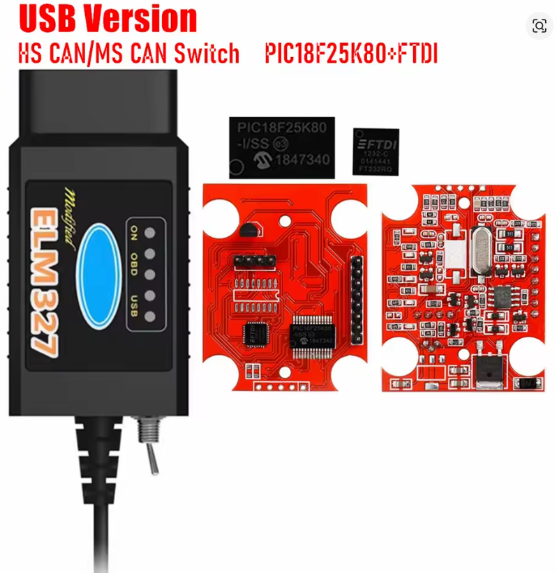
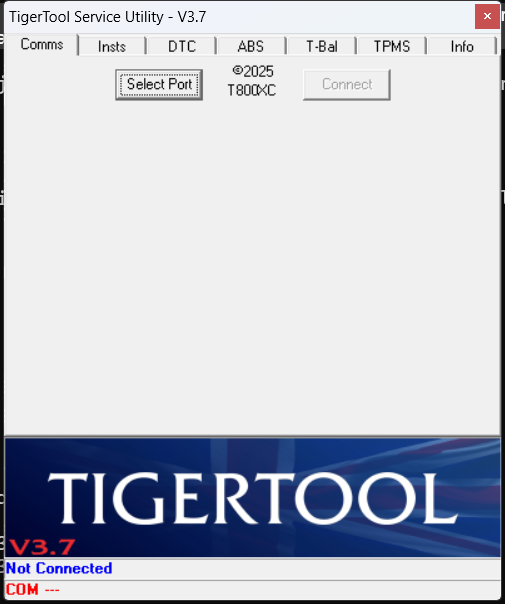
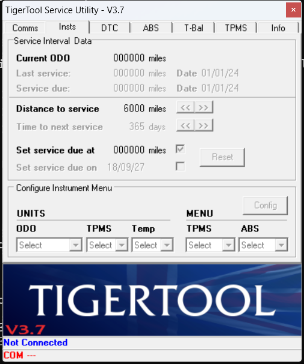

# Triumph Tiger — OBD Toolkit

Resetar o indicador de revisão (a *chave inglesa* do painel) de uma Triumph Tiger
usando um adaptador **ELM327 USB** barato e um PC com **Windows** — sem ir à
concessionária e sem comprar ferramenta proprietária.

Este repositório reúne **scripts de verificação em PowerShell** e um **guia
passo a passo** com as armadilhas que fazem a maioria das pessoas desistir no
meio do caminho.

> Validado em uma **Triumph Tiger 800 XRx 2016**, com ELM327 v1.5
> (PIC18F25K80 + FTDI FT232R) no Windows 11.

---

## Índice

- [Resumo rápido](#resumo-rápido)
- [O problema](#o-problema)
- [1. Hardware](#1-hardware)
- [2. Software: use TigerTool, não TuneECU](#2-software-use-tigertool-não-tuneecu)
- [3. Preparando o PC](#3-preparando-o-pc)
- [4. Os scripts deste repositório](#4-os-scripts-deste-repositório)
- [5. Procedimento na moto](#5-procedimento-na-moto)
- [6. Intervalos de revisão](#6-intervalos-de-revisão)
- [7. Solução de problemas](#7-solução-de-problemas)
- [Compatibilidade](#compatibilidade)
- [Avisos importantes](#avisos-importantes)
- [Licença](#licença)

---

## Resumo rápido

Se você só quer a resposta, é esta:

| | |
|---|---|
| **Adaptador** | ELM327 v1.5 USB (chip FTDI ou CH340) |
| **Se tiver chave HS/MS CAN** | Deixe em **`HS CAN`** — senão não conecta |
| **Conector na moto** | OBD-II preto de **16 pinos**, sob o banco do carona. **Sem adaptador.** |
| **Software** | **TigerTool** (gratuito, Windows) |
| **Software que NÃO serve** | TuneECU — não suporta USB nesta geração, e não tem mais versão Windows |
| **Onde reseta** | Aba `Insts` do TigerTool |
| **Condição da moto** | Ignição ligada, motor desligado, kill switch em `RUN` |

---

## O problema

A chave inglesa acende no painel e o manual manda ir à concessionária. Ao
pesquisar, você encontra três informações — e **duas delas provavelmente vão
te fazer perder tempo ou dinheiro**:

1. *"Use TuneECU"* — o conselho mais repetido nos fóruns. Só que, dependendo do
   ano da sua moto, o TuneECU **não funciona com adaptador USB**, e a versão
   Windows dele foi descontinuada há mais de uma década.
2. *"Você precisa de um adaptador de 6 pinos"* — verdade apenas para modelos
   **2024+**. Em motos anteriores o ELM327 comum encaixa direto.
3. *"Só a concessionária consegue"* — falso. O reset é feito por software.

Este guia existe para você não cair em nenhuma das três.

---

## 1. Hardware

### 1.1 O adaptador ELM327

O **ELM327** é um chip que traduz o barramento do veículo (CAN, K-line) para
comandos de texto simples numa porta serial. Praticamente todo adaptador OBD-II
barato é uma cópia dele.

Nem todo clone presta. O que procurar:

| Característica | Por quê |
|---|---|
| **Versão 1.5** | Versões "2.1" de clone quase sempre são falsas e com firmware pior. A 1.5 é a mais compatível com software de moto. |
| **Chip USB FTDI ou CH340** | Define o driver. FTDI costuma ser mais estável. |
| **Microcontrolador PIC18F25K80** | Indica um clone de boa qualidade, com firmware mais completo. |
| **Conexão USB** | Para TigerTool no PC. Bluetooth serve para o app TuneECU no Android. |

### 1.2 O adaptador usado nos testes



Modelo: **ELM327 v1.5 USB, "Modified", PIC18F25K80 + FTDI FT232RQ, com chave
HS CAN / MS CAN**.

- Link do exemplar testado: <https://aliexpress.com/item/1005006360821741.html>

> *Imagem do anúncio do vendedor, usada aqui para identificação do modelo.*

Não é indicação de loja — qualquer adaptador com essas características serve.
O ponto é reconhecer o conjunto certo: **v1.5 + PIC18F25K80 + FTDI**.

#### ⚠️ A chave HS CAN / MS CAN

Esse modelo tem um **interruptor lateral**, junto ao cabo. Ele não é decoração:
troca fisicamente quais pinos do conector OBD-II vão para o transceptor CAN.

| Posição | Barramento | Pinos OBD-II | Onde se usa |
|---|---|---|---|
| **HS CAN** | High Speed, 500 kbps | 6 e 14 | **Padrão. É o que a Triumph usa.** |
| **MS CAN** | Medium Speed, 125 kbps | 3 e 11 | Ford / Mazda, módulos de carroceria |

**Deixe em `HS CAN`.** Na posição errada o adaptador liga normalmente, acende
os LEDs e responde aos comandos `AT` — mas **nunca acha a moto**, porque está
escutando pinos que na Triumph não têm nada. É uma das causas mais frustrantes
de "não conecta", justamente porque tudo *parece* certo.

O script `3-checar-na-moto.ps1` detecta esse caso: mostra tensão de ~12 V
(o conector está bom) e, ao mesmo tempo, silêncio em todos os protocolos.

#### Como descobrir qual posição é a HS CAN

**A carcaça normalmente não tem marcação nenhuma**, e a posição varia entre
fabricantes — "chave virada para o lado do conector = HS" é folclore de fórum,
não vale confiar.

Na prática você não precisa descobrir antes: **resolve na própria moto, por
tentativa.** São duas posições.

1. Conecte na moto com a ignição ligada e rode `3-checar-na-moto.ps1`.
2. Se acusar **tensão ~12 V mas nenhum tráfego CAN**, vire a chave.
3. Rode de novo. A posição que mostrar quadros capturados é a `HS CAN`.

Leva dois minutos e não tem risco: o script só escuta, nunca escreve.

**Marque a posição correta** assim que descobrir — esmalte, fita ou risco de
caneta. Você não vai querer repetir isso agachado no estacionamento.

> Se preferir resolver antes de mexer na moto, o `4-identificar-chave.ps1`
> automatiza a comparação entre as duas posições. Ele funciona na moto e também
> em qualquer carro 2008+, que serve de gabarito porque o OBD-II obriga o
> diagnóstico a ficar em HS CAN. É conveniência, não pré-requisito.

<details>
<summary>Por que isso funciona</summary>

O conector OBD-II reserva pares de pinos diferentes para cada barramento:

- **Pinos 6 e 14** — CAN High e CAN Low do barramento de alta velocidade
  (500 kbps). É onde vive o diagnóstico. O OBD-II original (1996) admitia
  vários protocolos; o CAN nesses pinos passou a ser obrigatório nos
  veículos a partir de 2008, e é por isso que qualquer carro dessa idade
  serve de gabarito.
- **Pinos 3 e 11** — barramento de média velocidade (125 kbps), opcional e
  usado principalmente pela Ford e pela Mazda para módulos de carroceria.

O interruptor apenas escolhe qual desses pares chega ao transceptor CAN do
adaptador. Como a Triumph — e praticamente todo veículo fora de Ford/Mazda —
só tem sinal em 6/14, a posição que enxerga tráfego é a HS CAN.

</details>

### 1.3 Como saber se o seu adaptador presta

Plugue o adaptador **só no USB** (sem a moto) e rode:

```powershell
.\1-testar-adaptador.ps1
```

O script varre as velocidades comuns (38400, 9600, 115200, 500000) e conversa
com o chip. Saída de um adaptador saudável:

```
=== Tentando COM5 @ 38400 ===
  >>> CONECTADO em 38400 <<<
  ATI   : ELM327 v1.5
  AT@1  : OBDII to RS232 Interpreter
  ATDP  : AUTO, ISO 15765-4 (CAN 29/500)
  ATRV  : 0.0V
```

`ATRV` marcar **0.0V é normal aqui** — o adaptador mede a tensão da moto, e
ela ainda não está conectada.

<details>
<summary>O que cada comando significa</summary>

| Comando | Função |
|---|---|
| `ATZ` | Reset do adaptador; devolve a versão do firmware |
| `ATI` | Identificação da versão |
| `AT@1` | Descrição do fabricante |
| `ATE0` | Desliga o eco (não repetir o que foi enviado) |
| `ATDP` / `ATDPN` | Protocolo em uso (nome / número) |
| `ATRV` | Tensão lida no pino de alimentação |
| `ATSP<n>` | Força um protocolo específico |
| `ATMA` | *Monitor All* — escuta o barramento sem transmitir nada |

</details>

### 1.4 O conector da moto

Na Tiger 800 (e na maioria das Triumph até ~2023) o conector de diagnóstico é o
**OBD-II preto de 16 pinos**, igual ao de carro, sob o **banco do carona, lado
direito**, protegido por uma capa emborrachada.

| Geração | Conector | Precisa adaptador? |
|---|---|---|
| Até ~2023 | OBD-II 16 pinos, preto | **Não** — liga direto |
| 2024+ | 6 pinos vermelho (Euro 5, ISO 19689) | **Sim** — cabo 16→6 pinos |

> Muita gente compra o adaptador de 6 pinos sem precisar, porque os fóruns
> misturam as gerações. Confira o seu conector antes de comprar.

---

## 2. Software: use TigerTool, não TuneECU

### 2.1 Por que TuneECU não resolve

O TuneECU é excelente e é a referência para Triumph — **mas só nas combinações
que ele suporta**. A lista oficial de compatibilidade traz colunas separadas
para cada tipo de interface. Compare duas linhas:

```
Bikes                                      USB(1)   OBD(2)  OBDLink(3)
Tiger 800, 800 XC (até 2014)               D/R/W      D         D
Tiger 800 XC, XCX, XR, XRX (2015-2017)    (vazio)     D        D/W
```

`D` = diagnóstico · `R` = ler mapa · `W` = gravar mapa

Na geração 2015–2017 a **coluna USB está vazia**. Só há suporte via Bluetooth
(`OBD`) ou OBDLink. Somando a isso:

- A **versão Windows do TuneECU foi descontinuada** — a última foi a 2.5.8, de
  cerca de 2012, e não cobre as motos com CAN mais novas.
- Os modelos recentes são atendidos apenas pelo **aplicativo Android**.

Ou seja: com ELM327 **USB** + **Windows**, o TuneECU está fora. Para usá-lo você
precisaria de um adaptador **Bluetooth** (ELM327 BT ou, garantido, um OBDLink
LX/MX+) e de um celular Android.

### 2.2 TigerTool

O **TigerTool** é um utilitário gratuito para uso não comercial, escrito pelo
autor conhecido como **T800XC** (*Little Dog Systems*). Ele:

- roda em **Windows** (binário nativo de 32 bits, não precisa .NET);
- fala com **ELM327 comum por porta COM**, versões `V1.n` ou `V2.n`;
- cobre Tiger 800, 900, Sport, Explorer/1200, Trophy, Speed Triple, Trident 660;
- **reseta o intervalo de revisão na aba `Insts`**, além de outras funções.

A janela é pequena e organizada em sete abas:

| Aba | Para que serve |
|---|---|
| `Comms` | Escolher a porta COM e conectar. É por onde se começa. |
| **`Insts`** | **Instrumentos: intervalo de revisão e unidades. É onde o reset acontece.** |
| `DTC` | Códigos de falha — ler e apagar |
| `ABS` | Funções do ABS, incluindo sangria |
| `T-Bal` | Balanceamento dos corpos de borboleta |
| `TPMS` | Sensores de pressão dos pneus |
| `Info` | Dados da ECU |

### 2.3 Onde baixar

A distribuição oficial é por anexo no fórum **tiger800.co.uk**, que exige
cadastro. Atenção: esse fórum usa **bloqueio do Cloudflare por região** — em
alguns países ele retorna *"Sorry, you have been blocked"* e **VPN muitas vezes
não resolve**.

Rota alternativa confiável: o servidor da **BMDiag**, empresa que vende a
interface OBD oficial do TigerTool e hospeda o manual dele. A listagem de
diretório é negada, mas os arquivos são servidos direto pelo nome exato:

```
https://www.bmdiag.co.uk/user/tiger%20tool/TigerToolV3.7.zip   (v3.7, 2025)
https://www.bmdiag.co.uk/user/tiger%20tool/TigerTool.zip       (v3.5.1, 2024)
```

O manual em PDF está em:

```
https://www.bmdiag.co.uk/user/tiger%20tool/TigerTool%20V3.0%20Instructions.pdf
https://coeleveld.com/wp-content/uploads/2019/02/TigerTool-V3.7-Instructions.pdf
```

### 2.4 Verificando o que você baixou

O TigerTool **não é assinado digitalmente** — normal para utilitário gratuito de
hobbyista, mas significa que o SmartScreen vai avisar na primeira execução
(*Mais informações* → *Executar assim mesmo*). Confira os metadados antes:

```powershell
$exe = ".\TigerTool.exe"
(Get-Item $exe).VersionInfo | Format-List ProductName, FileVersion, CompanyName, LegalCopyright
Get-FileHash $exe -Algorithm SHA256
& "$env:ProgramFiles\Windows Defender\MpCmdRun.exe" -Scan -ScanType 3 -File (Resolve-Path $exe)
```

Valores esperados para a **v3.7**:

| Campo | Valor |
|---|---|
| ProductName | `TigerTool` |
| FileVersion | `3.7.0.0` |
| CompanyName | `Little Dog Systems` |
| LegalCopyright | `(C) 2025 - T800XC` |
| SHA-256 (.exe) | `429A489317A0F06BAF892BEC704496CD98424171731583C153DA26C2CCB9A470` |
| SHA-256 (.zip) | `A5926E0D815DD7C221F795AE994DBDFDF51C1F92FE98475E82CA4A1FB658CF2D` |

> Os binários **não são redistribuídos aqui** — são software de terceiros, com
> direitos do autor original. Baixe da fonte e confira o hash.

---

## 3. Preparando o PC

### 3.1 Driver

- **FTDI** (`VID_0403`): o Windows costuma instalar sozinho. Se não, use o
  driver VCP do site da FTDI.
- **CH340 / CP210x**: instale o driver correspondente ao chip.

### 3.2 Descobrir a porta COM

```powershell
Get-PnpDevice -Class Ports | Select-Object Status, FriendlyName, InstanceId
```

Procure algo como `USB Serial Port (COM5)`. Anote o número — todos os scripts
aceitam `-Port COMx` (o padrão é `COM5`).

### 3.3 Ajuste de latência (FTDI) — não pule

O driver FTDI vem com **latency timer de 16 ms**. Esse valor faz o driver
esperar até 16 ms antes de entregar bytes recebidos, o que **derruba a conexão**
de softwares ELM327, que esperam resposta rápida. Baixar para **2 ms** resolve
travamentos e erros de "no response" intermitentes.

```powershell
# clique direito > Executar como administrador
.\2-ajuste-ftdi.ps1

# para desfazer
.\2-ajuste-ftdi.ps1 -Reverter
```

Depois **desconecte e reconecte o cabo USB** para aplicar.

> Só se aplica a adaptadores FTDI. Com CH340/CP210x, pule.

### 3.4 Liberando os scripts baixados

Arquivos vindos da internet chegam com uma *marca de download*, e o PowerShell
se recusa a executá-los:

```
... não pode ser carregado. A execução de scripts foi desabilitada neste sistema.
```

Isso não é defeito do repositório — é o Windows protegendo você de rodar script
de origem desconhecida. Depois de baixar (seja o ZIP do GitHub ou via `git
clone`), abra o PowerShell **na pasta do projeto** e rode:

```powershell
Get-ChildItem *.ps1 | Unblock-File
```

Se ainda assim reclamar, autorize só para a janela atual — o efeito termina
quando você a fecha, e nada no sistema é alterado de forma permanente:

```powershell
Set-ExecutionPolicy -Scope Process -ExecutionPolicy Bypass
```

> Leia os scripts antes de liberar. São quatro arquivos curtos e em texto puro,
> exatamente para que você possa conferir o que fazem.

### 3.5 Onde colocar o TigerTool

Deixe o `TigerTool.exe` **na mesma pasta dos scripts**. Ele não precisa de
instalação: é um executável único, sem dependências. Os exemplos de comando
deste guia assumem esse layout.

---

## 4. Os scripts deste repositório

| Script | Quando usar | Escreve na ECU? |
|---|---|---|
| `1-testar-adaptador.ps1` | Na bancada, antes de tudo | Não — nem conecta na moto |
| `2-ajuste-ftdi.ps1` | Uma vez, como administrador | Não — mexe no registro do Windows |
| `3-checar-na-moto.ps1` | Com a moto ligada, antes de abrir o TigerTool | **Não — somente leitura** |
| `4-identificar-chave.ps1` | Uma vez, se o adaptador tiver chave HS/MS CAN | **Não — somente leitura** |

Parâmetros aceitos por cada um (o padrão de porta é sempre `COM5`):

| Script | Parâmetros |
|---|---|
| `1-testar-adaptador.ps1` | `-Port`, `-Bauds` (lista de velocidades a testar) |
| `2-ajuste-ftdi.ps1` | `-Reverter` — não recebe porta, age no driver |
| `3-checar-na-moto.ps1` | `-Port`, `-Baud` |
| `4-identificar-chave.ps1` | `-Port`, `-Baud`, `-Segundos` |

```powershell
.\1-testar-adaptador.ps1  -Port COM7
.\3-checar-na-moto.ps1    -Port COM7 -Baud 38400
.\4-identificar-chave.ps1 -Port COM7 -Segundos 5
```

### O que o `3-checar-na-moto.ps1` faz

É o script que economiza tempo. Antes de você culpar o software, ele confirma
a camada física:

1. **Tensão** (`ATRV`) — deve ler ~12 V. É a prova de que o conector encaixou e
   a ignição está ligada.
2. **Varredura de protocolo** — testa `ATSP6` a `ATSP9` (CAN 11/29 bits,
   500/250 kbps).
3. **Tráfego real** (`ATMA`) — escuta o barramento e mostra os quadros
   capturados. Se aparecerem quadros, a moto está conversando.

Nenhum byte de escrita é enviado à ECU.

Formato da saída quando tudo está certo *(valores ilustrativos — a tensão e os
quadros variam de moto para moto)*:

```
[1] Adaptador ......... OK  (ELM327 v1.5)
[2] Tensao da moto .... 12.4V
[3] Procurando trafego no barramento CAN...
    ATSP6  ISO 15765-4 CAN 11 bit / 500 kbps
       -> 47 quadros capturados. Exemplo:
          18F00300 12 7D 00 00 00 00 00 00
```

---

## 5. Procedimento na moto

### 5.1 Preparação física

1. Remova o **banco do carona**. Localize o conector preto de 16 pinos, do lado
   direito do vão.
2. Se o seu adaptador tiver interruptor, ele precisa estar em **`HS CAN`**.
3. Conecte o ELM327 na moto e o USB no notebook.
4. **Kill switch em `RUN`.**
5. **Ignição ligada, motor desligado.** O painel acende; não dê partida.

> **Bateria:** ignição ligada com motor parado consome. Se for demorar, use um
> carregador de manutenção — a ECU perder alimentação no meio de uma escrita é
> exatamente o cenário a evitar.

### 5.2 Confirme a conexão antes de abrir o software

```powershell
.\3-checar-na-moto.ps1
```

Só siga adiante com **tensão ~12 V e quadros CAN capturados**. Resolver
problema de cabo dentro do TigerTool é muito mais confuso do que aqui.

### 5.3 Conectando o TigerTool



A janela abre na aba **`Comms`**, e é a única coisa utilizável no começo:
todo o resto fica desabilitado até haver conexão. Repare na barra inferior —
ela mostra **`Not Connected`** e **`COM ---`**. Essa barra é o seu indicador de
estado durante todo o processo.

1. Clique em **`Select Port`** e escolha a porta COM do seu adaptador.
2. O botão **`Connect`**, antes cinza, fica disponível. Clique nele.
3. A barra inferior deve passar a indicar conexão e mostrar a COM ativa.

Se travar aqui, volte para a [tabela de problemas](#7-solução-de-problemas) —
quase sempre é porta errada, latency timer ou a chave HS/MS CAN.

### 5.4 A aba `Insts`, campo por campo



> *Captura feita **sem** a moto conectada. Os valores acima são apenas
> espaços reservados; com a moto ligada eles são preenchidos com os dados
> reais lidos da ECU.*

O quadro **`Service Interval Data`** tem duas metades: o que a moto diz, e o
que você vai definir.

**Leitura — o que a moto informa** *(somente leitura)*

| Campo | O que é |
|---|---|
| `Current ODO` | Odômetro atual da moto |
| `Last service` | Quilometragem e data da última revisão registrada |
| `Service due` | Quilometragem e data em que a próxima revisão vence |

**Ajuste — o que você define**

| Campo | Para que serve |
|---|---|
| `Distance to service` | Intervalo até a próxima revisão. Ajusta-se pelos botões `<<` (diminui) e `>>` (aumenta), em passos. |
| `Time to next service` | Prazo em dias (o padrão mostrado é `365`, ou seja, um ano). |
| `Set service due at` | **Caixa de seleção.** Marcada, aplica o vencimento por distância. |
| `Set service due on` | **Caixa de seleção.** Marcada, aplica o vencimento por data. |
| `Reset` | Grava na ECU. É o botão que efetiva tudo. |

As duas caixas são independentes: você pode vencer a revisão por distância, por
data, ou por ambos — o que ocorrer primeiro.

> **Atenção às unidades.** Na captura acima os campos aparecem em **milhas**.
> Antes de ajustar qualquer número, **confira o `Current ODO` contra o
> odômetro do painel**: se bater com o valor em km que você vê na moto, você
> está trabalhando em km; se estiver por volta de 60% dele, está em milhas.
> Confundir os dois faz você definir 10.000 milhas (16.000 km) achando que
> são 10.000 km — mais de um intervalo e meio a mais do que deveria.

#### O quadro `Configure Instrument Menu` — cuidado

Logo abaixo há um segundo quadro, com `UNITS` (`ODO`, `TPMS`, `Temp`),
`MENU` (`TPMS`, `ABS`) e um botão `Config`.

**Ele não controla a exibição do TigerTool. Ele configura o painel da moto** —
a unidade que o odômetro mostra, as unidades de pressão e temperatura, e quais
itens aparecem no menu do instrumento.

Não mexa nele para "trocar a unidade da tela" do programa. Isso grava
configuração no painel e é assunto separado do reset de revisão. Para resetar a
revisão você só precisa do quadro `Service Interval Data`.

### 5.5 Fazendo o reset

1. Confirme que está conectado (barra inferior).
2. Confira em que unidade você está, comparando `Current ODO` com o odômetro
   do painel.
3. Ajuste **`Distance to service`** com `<<` e `>>` até o intervalo desejado
   — para a Tiger 800, **10.000 km / 6.000 mi** (veja a
   [tabela de intervalos](#6-intervalos-de-revisão)).
4. Se quiser limite por tempo, ajuste **`Time to next service`**.
5. Marque **`Set service due at`** e/ou **`Set service due on`**, conforme o
   critério que você quer usar.
6. Clique em **`Reset`**.
7. Aparece uma confirmação — a janela se chama **`CONFIRM RESET?`**. Leia e
   confirme.
8. A chave inglesa deve sumir do painel. Os campos de leitura passam a mostrar
   os valores novos.

> A caixa de confirmação existe no programa (verificada no executável), mas o
> texto exato dela não foi observado com a moto conectada. Leia com atenção
> antes de confirmar.

### 5.6 Encerrando

1. Feche o TigerTool.
2. Desligue a ignição.
3. Desconecte o adaptador e recoloque o banco.
4. Ligue a moto e **confirme no painel** que a chave inglesa não voltou.

---

## 6. Intervalos de revisão

Referência para a Tiger 800, útil na hora de definir o próximo valor:

| Serviço | Intervalo |
|---|---|
| Primeira revisão | 800 km / 500 mi |
| Revisão normal | **10.000 km / 6.000 mi** ou 12 meses |
| Revisão maior (válvulas, velas, filtro de ar) | 20.000 km / 12.000 mi |
| Fluido de freio | 2 anos |
| Líquido de arrefecimento | 3 anos |

Confirme no manual do seu ano/mercado — pode variar.

---

## 7. Solução de problemas

| Sintoma | Causa provável | O que fazer |
|---|---|---|
| `ATRV` mostra 0.0 V na moto | Ignição desligada, kill switch fora de `RUN`, ou conector mal encaixado | Revise os três antes de qualquer outra coisa |
| Script não acha a porta | Driver ausente ou porta errada | `Get-PnpDevice -Class Ports`; instale o driver do chip |
| Conecta e cai no meio | Latency timer do FTDI em 16 ms | Rode `2-ajuste-ftdi.ps1` como admin e reconecte o USB |
| **Nenhum tráfego CAN, mas 12 V OK** | **Chave do adaptador em `MS CAN`** | **Vire a chave e repita.** Primeiro suspeito em adaptadores com interruptor |
| Idem, e a chave já está certa (ou não existe) | Barramento dormindo | Confirme ignição ligada e painel aceso; o CAN só acorda com a moto energizada |
| Scripts não executam: "execução de scripts foi desabilitada" | Política do PowerShell + marca de download | Veja [3.4](#34-liberando-os-scripts-baixados) |
| "Acesso à porta COMx negado" | Outro programa está com a porta aberta | Feche o TigerTool e outras janelas do PowerShell. Os scripts liberam a porta sozinhos, inclusive em caso de erro |
| Adaptador não responde a `ATZ` | Clone ruim ou baud diferente | O script varre 4 velocidades; se nenhuma responder, troque o adaptador |
| SmartScreen bloqueia o TigerTool | Executável não assinado | *Mais informações* → *Executar assim mesmo*, após conferir o hash |
| Site tiger800.co.uk bloqueado | Bloqueio do Cloudflare por região | Use o espelho da BMDiag (seção 2.3) |

---

## Compatibilidade

**Testado:** Triumph Tiger 800 XRx 2016 · ELM327 v1.5 FTDI · Windows 11.

**Deve funcionar** (segundo a documentação do TigerTool): Tiger 800, Tiger 900,
Tiger Sport, Tiger Explorer / 1200, Trophy, Speed Triple, Trident 660.

Os scripts em si são genéricos: servem para **qualquer moto ou carro com
ELM327** como diagnóstico de camada física, já que só leem. O que é específico
da Triumph é o TigerTool.

Rodou em outro modelo? Abra uma *issue* contando o resultado.

---

## Avisos importantes

- **Os scripts deste repositório são somente leitura.** Não enviam nenhum
  comando de escrita para a ECU.
- **Não tente forçar o reset com comandos crus.** Mandar escrita "às cegas" em
  módulo de moto pode corromper configuração. O TigerTool existe porque alguém
  já fez o trabalho de mapear isso corretamente.
- **O TigerTool é software de terceiros**, não assinado e fornecido *as-is*.
  Confira a origem e o hash antes de executar.
- **Resetar o indicador não faz a revisão.** O contador é um lembrete; troque o
  óleo de verdade.
- Mexer na ECU pode ter implicações de garantia. Decisão sua.

---

## Licença

Os scripts e a documentação deste repositório estão sob a licença
[MIT](LICENSE).

**Não se aplica ao TigerTool**, que é software de terceiros com direitos do
autor original (T800XC / Little Dog Systems), distribuído gratuitamente para uso
não comercial. Este repositório não redistribui o binário — apenas documenta
onde obtê-lo e como verificá-lo.
